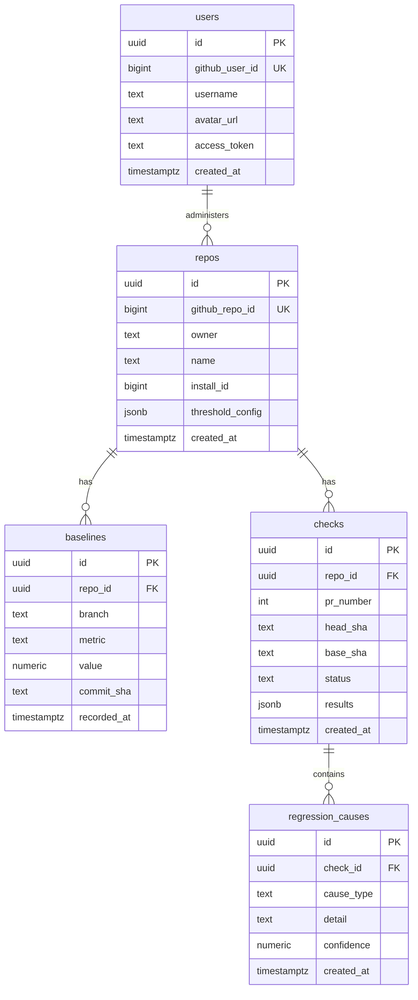

# 🛡️ DeployGuard

> **Automated performance quality gates & AI-powered regression analysis for Pull Requests.**
> 
> DeployGuard is a full-stack, enterprise-grade GitHub App that detects and blocks performance regressions (bundle size bloat, DB query regressions, and API latency spikes) *before* they hit production. It posts native GitHub Check Runs and markdown analysis comments directly on PRs, complete with NLP-powered root-cause classification and Groq-powered AI explanations.

---

## 🚀 Why This Project Matters (The Core Problem)

In modern web development, performance regressions typically slip into production silently. A developer imports a heavy UI package (like Moment.js or Three.js) or writes an unoptimized database query, and the issue goes unnoticed until users complain about slow loading times, or cloud hosting costs skyrocket.

DeployGuard solves this by **shifting performance analysis left** (directly into the developer's pull request workflow):
* **Protects Core Web Vitals:** Blocks PRs that exceed maximum allowable bundle size increases to maintain page load speed and SEO rankings.
* **Reduces Database/API Load:** Prevents N+1 queries, full table scans, or latency-inducing sync operations from merging.
* **Automates Cause Resolution:** Instead of forcing developers to manually run profiles to find why a bundle grew, DeployGuard classifies the cause (e.g. upgraded dependencies, static assets, refactoring) and generates copy-pasteable fix commands or code suggestions.

---

## 🏗️ Architectural Overview

DeployGuard is designed using a **decentralized build pattern** to guarantee security, scalability, and zero compute costs for compilation:

```
[ Developer PR ] ────▶ [ GitHub Actions Runner ] ────▶ [ DeployGuard Webhook ]
                             (Builds & Measures)             (NLP Analysis & AI Review)
                                     │                                  │
                                     ▼                                  ▼
                            (Uploads bundle-stats)           (Posts PR Checks & Comments)
```

The system is split into three main services:

### 1. 🛡️ Express.js Web Server Backend (`apps/server`)
The backend orchestrates the integration, database storage, and webhook processing:
* **Webhook Ingestion:** Authenticates cryptographic payloads from GitHub App webhooks.
* **PR Analysis Flow:** On a new PR, it schedules a pending GitHub Check. When the Action runner completes, it fetches the artifact ZIP, parses the metadata `stats.json`, and triggers package diffs and commit classifiers.
* **Dashboard API:** Serves repo history, threshold configurations, and OAuth user sessions.

### 2. 🤖 FastAPI NLP & AI Service (`apps/nlp`)
A dedicated Python service responsible for semantic commit classification and Groq LLM pipelines:
* **ML Classifier:** Uses local sentence embeddings (`all-MiniLM-L6-v2`) and a trained classification model to categorize commit messages.
* **AI Fallback & Generator:** Uses Groq's API (`llama-3.1-8b-instant`) to classify ambiguous commit messages and generate markdown analysis explanations.

### 3. 💻 React Dashboard (`apps/web`)
A modern, responsive user interface designed with rich aesthetics:
* **Real-time Metrics:** Displays a repository directory containing check metrics (passes/fails/totals) and historical charts.
* **Visual Gates Control:** Allows developers to customize performance thresholds (e.g. allow up to +15 KB bundle size growth) via visual slider inputs.
* **AI Reports:** Displays structured health reports (Strengths, Risks, and Recommendations) generated automatically by Groq.

---

## 📁 Project Structure

```
Deploy-Guard/
│
├── .github/
│   └── workflows/
│       └── bundle-analysis.yml          # DeployGuard's own CI — builds the React dashboard
│                                        # and uploads stats.json on every PR and main push
│
├── apps/
│   │
│   ├── server/                          # Node.js · Express · @octokit/app
│   │   └── src/
│   │       ├── analysers/
│   │       │   ├── bundle.js            # Downloads the CI artifact ZIP via GitHub API,
│   │       │   │                        # parses stats.json, and returns totalKb
│   │       │   └── packageDiff.js       # Diffs package.json between base and head SHA
│   │       │                            # to detect newly added / removed dependencies
│   │       ├── nlp/
│   │       │   └── client.js            # HTTP client for the FastAPI NLP microservice
│   │       ├── routes/
│   │       │   └── api.js               # REST API — repos, checks, thresholds, AI review,
│   │       │                            # and GitHub OAuth callback
│   │       ├── utils/
│   │       │   └── groqExplain.js       # AI explanation client — tries NLP service first,
│   │       │                            # falls back to calling Groq directly from Node
│   │       ├── __tests__/
│   │       │   └── webhook.test.js      # Unit tests for webhook pipeline logic
│   │       ├── comment.js               # Builds the markdown PR comment body
│   │       ├── db.js                    # All PostgreSQL queries (repos, baselines, checks)
│   │       └── webhook.js               # GitHub App event handlers — the core pipeline
│   │
│   ├── nlp/                             # Python · FastAPI · SentenceTransformers · Groq
│   │   ├── ai_features.py               # explain_regression(), review_repo(), summarize_pass()
│   │   ├── groq_client.py               # Shared async Groq API wrapper (call_groq)
│   │   ├── main.py                      # FastAPI app + /classify /explain /summarize /review
│   │   ├── train_v2.py                  # Trains the SentenceTransformer commit classifier
│   │   ├── requirements.txt
│   │   └── Dockerfile
│   │
│   └── web/                             # React · Vite · Recharts · Tailwind
│       ├── scripts/
│       │   └── generate-stats.mjs       # Post-build script — scans dist/ and writes stats.json
│       └── src/
│           ├── components/
│           │   ├── AIReviewCard.jsx      # Renders the Groq health review panel
│           │   ├── Badge.jsx             # Status badge (pass / fail / neutral)
│           │   ├── CheckRow.jsx          # Single check entry in the history table
│           │   ├── MetricChart.jsx       # Recharts line chart for bundle size history
│           │   ├── Navbar.jsx            # Top navigation with OAuth user state
│           │   ├── ParticleBackground.jsx # Animated canvas particle effect
│           │   └── RepoCard.jsx          # Repository summary card with delta indicators
│           ├── pages/
│           │   ├── AuthCallback.jsx      # Handles GitHub OAuth redirect → stores token
│           │   ├── Dashboard.jsx         # Main view — repo list + onboarding modal
│           │   ├── Docs.jsx              # In-app documentation page
│           │   ├── Login.jsx             # Landing / login page
│           │   ├── RepoDetail.jsx        # Per-repo check history and threshold settings
│           │   └── Settings.jsx          # Threshold configuration sliders
│           ├── api.js                    # Axios wrapper for all backend API calls
│           └── index.css                 # Global styles + design tokens
│
├── db/
│   └── migrations/
│       └── 001_initial.sql              # Full PostgreSQL schema (repos, baselines,
│                                        # checks, regression_causes, users)
│
├── docs/
│   └── onboarding.md                    # Step-by-step integration guide for tenant repos
│
├── .env.example                         # Environment variable reference with descriptions
├── package.json                         # npm workspaces root — runs all apps concurrently
├── render.yaml                          # Render.com deployment config for server + web
└── README.md
```

## 💾 Database Schema Design



* **`repos`**: Tracks connected repositories, metadata, and custom threshold gate limits.
* **`baselines`**: Maintains size, query, and API latency measurements per branch to evaluate regressions.
* **`checks`**: Tracks pull request evaluations (statuses, comparisons, and timestamps).
* **`regression_causes`**: Links NLP model classifications and confidence scores to checks.
* **`users`**: Manages developer credentials and access tokens obtained via GitHub OAuth.

---

## 💡 Key Engineering Decisions & Trade-Offs

### 1. Zero-Configuration Build Scanner
* **Decision:** We use an inline Node.js directory-scanning script inside the Actions runner rather than forcing developers to configure bundler plugins (like `rollup-plugin-visualizer`) in their `vite.config.js`.
* **Why:** Requiring manual bundler config edits makes onboarding complex and error-prone. By scanning the `dist/` directory directly, DeployGuard works instantly out of the box for any standard bundler (Vite, Webpack, Rollup) without package installations.

### 2. Cascaded Hybrid NLP Classification Engine
* **Decision:** Commits are classified using a 3-tier cascade pipeline:
  1. **Tier 1 (Local Model):** Classifies the message using SentenceTransformer embeddings ($<50$ms latency, zero cost).
  2. **Tier 2 (Groq LLM Fallback):** If local model confidence is low ($<0.55$), it calls the Groq API ($~200$ms).
  3. **Tier 3 (Graceful Fallback):** If the LLM is rate-limited or offline, it falls back to the top local prediction.
* **Why:** Avoids calling expensive LLM APIs on every git commit, resulting in massive cost savings and low latency while preserving high classification accuracy.

---

## 🛠️ Key Technical Challenges Solved (My Contributions)

During development, I designed and resolved several critical system bugs and features:

* **Direct Push Baseline Update Fix:** Solved a critical bug in `webhook.js` where direct pushes or PR merges to `main` or `master` (which do not have open PRs) were skipped entirely. This left the baselines database table empty, causing all checks to report `n/a (first run)`. Added direct branch triggers to record base metrics.
* **Monorepo & Subfolder Support:** Configured the setup templates to support repositories that split codebase folders (such as `frontend/` and `backend/`). Integrated step-scoped `working-directory` execution and turned off default `setup-node` caching to prevent crashes on subfolder projects missing root-level lockfiles.
* **Target Branch Fallback Engine:** Introduced baseline fallback matching. If a PR is opened against a feature branch that hasn't had a baseline recorded in the database, DeployGuard automatically falls back to comparing against the default branch (`main` or `master`) baseline instead of displaying `n/a`.
* **FastAPI Local Environment Loading:** Resolved an issue where the NLP microservice failed to load the `GROQ_API_KEY` from the local `.env` file when started via standard Uvicorn commands (disabling LLM-based features). Integrated `python-dotenv` to load local configurations cleanly at startup.
* **Zero-Escaping Node script:** Rewrote the inline Node.js bundle scanner to use standard string manipulation (`path.extname` and `.split`/`.join`) instead of regex and backslashes, ensuring that the script executes cleanly across `bash`, `cmd`, or `sh` shells without getting parsed incorrectly by GitHub Actions runners.
* **Cross-Fork PR API Fallback:** Fixed a bug where external contributor PRs (originating from forks) failed because GitHub restricts the payload `workflow_run.pull_requests` for security. Added an API callback fallback that queries open pulls on the target head SHA.
* **CSS Transform Positioning Fix:** Resolved an issue where the React onboarding modal was pushed to the bottom of the screen. Solved this by restructuring the React DOM hierarchy, rendering the fixed modal outside the parent `transform` container which was overriding the browser viewport layout.

---

## 🚀 Getting Started (Local Development)

### Prerequisites
* Node.js 20+
* Python 3.11+
* PostgreSQL 15+ (Local or Neon)
* A [GitHub App registration](https://docs.github.com/en/apps) with Webhook + Checks permissions.

### 1. Installation
```bash
# Clone the repository
git clone https://github.com/Saksham842/Deploy-Guard.git
cd Deploy-Guard

# Install root, server, and web dependencies (npm workspaces)
npm install

# Setup python environment and train the NLP models
cd apps/nlp
python -m venv venv
# Activate virtualenv and install packages
source venv/bin/activate  # Or .\venv\Scripts\activate on Windows
pip install -r requirements.txt
python train_v2.py
```

### 2. Configure Environment
Create a `.env` file at the root of the project:
```bash
cp .env.example .env
```
Provide your database connection strings, GitHub App credentials, and base64-encoded private key PEM file.

### 3. Start Development Servers
Run the backend and dashboard concurrently:
```bash
# In the root workspace:
npm run dev
```
Start the NLP FastAPI microservice:
```bash
# In apps/nlp:
uvicorn main:app --reload --port 8000
```

---

## 🔌 API Documentation

### NLP Microservice (`apps/nlp` — FastAPI)
| Method | Endpoint | Description |
|--------|----------|-------------|
| `POST` | `/classify` | Evaluates commit message categories (Local ML $\rightarrow$ Groq LLM) |
| `POST` | `/explain` | Generates PR markdown explanation for regressions (Groq) |
| `POST` | `/review` | Compiles aggregated health analysis metrics (Groq) |

### Backend API (`apps/server` — Express)
| Method | Endpoint | Description |
|--------|----------|-------------|
| `GET`  | `/api/repos` | Lists connected repositories for the authenticated user |
| `GET`  | `/api/repos/:owner/:name/checks` | Retrieves the history of performance check runs |
| `PUT`  | `/api/repos/:owner/:name/thresholds` | Updates size/latency alert thresholds |

---

*Developed and maintained with ❤️ by [Saksham Hans](https://github.com/Saksham842).*
